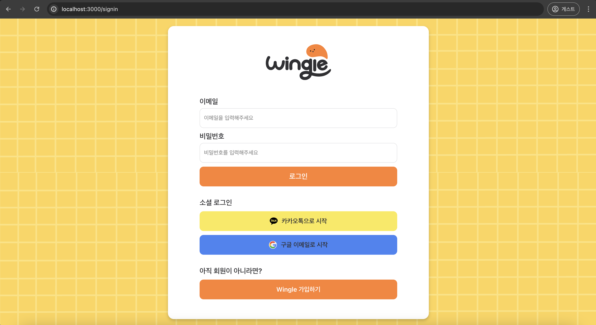
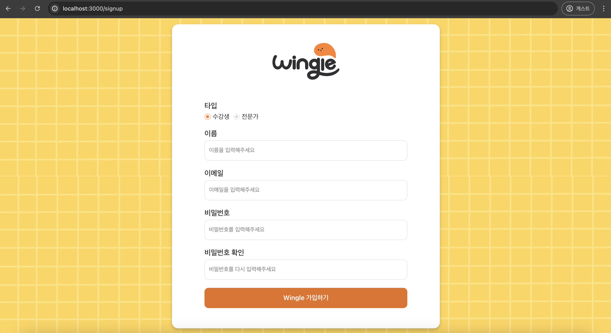
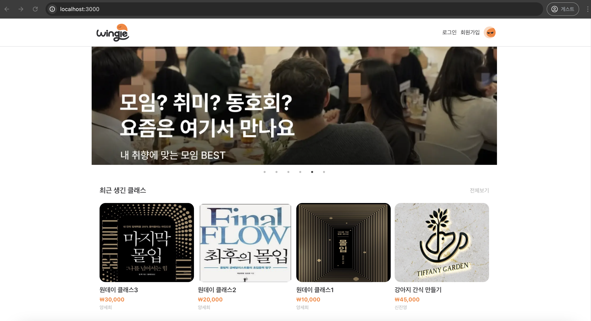
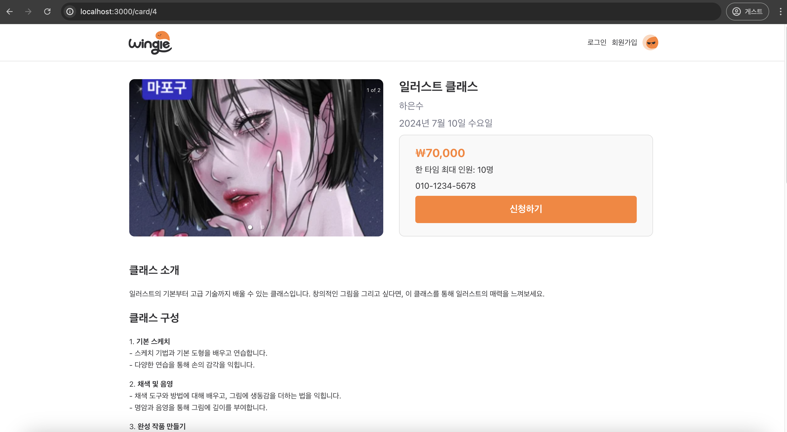
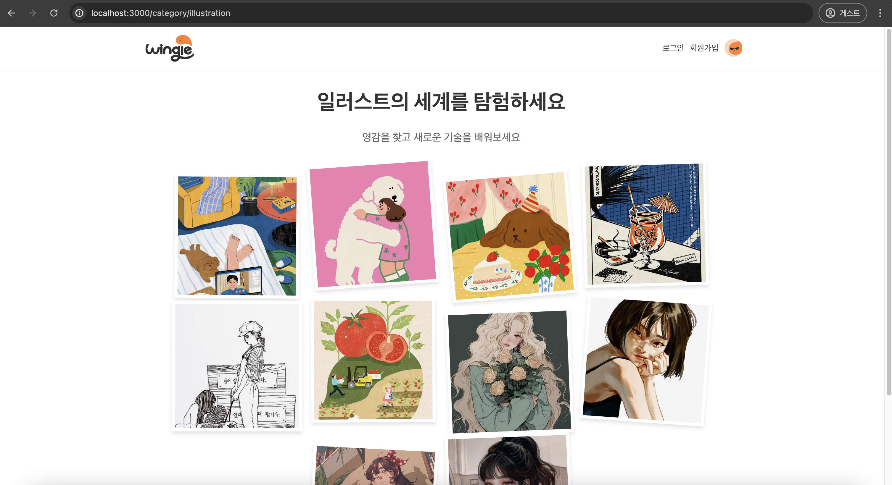
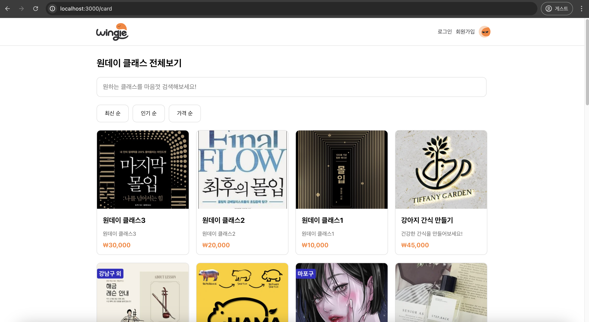
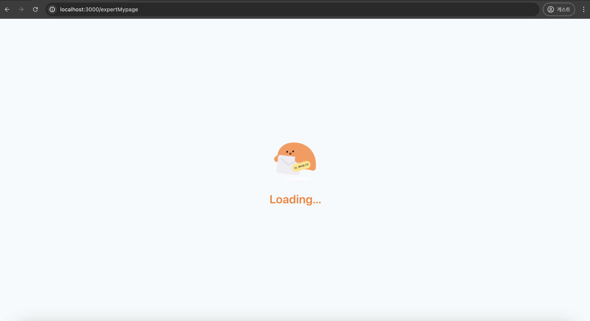
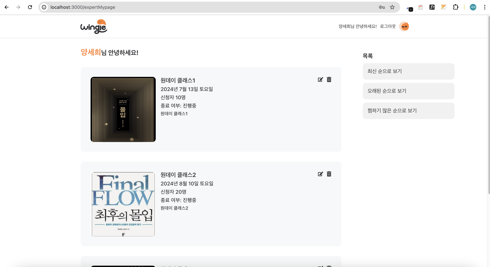
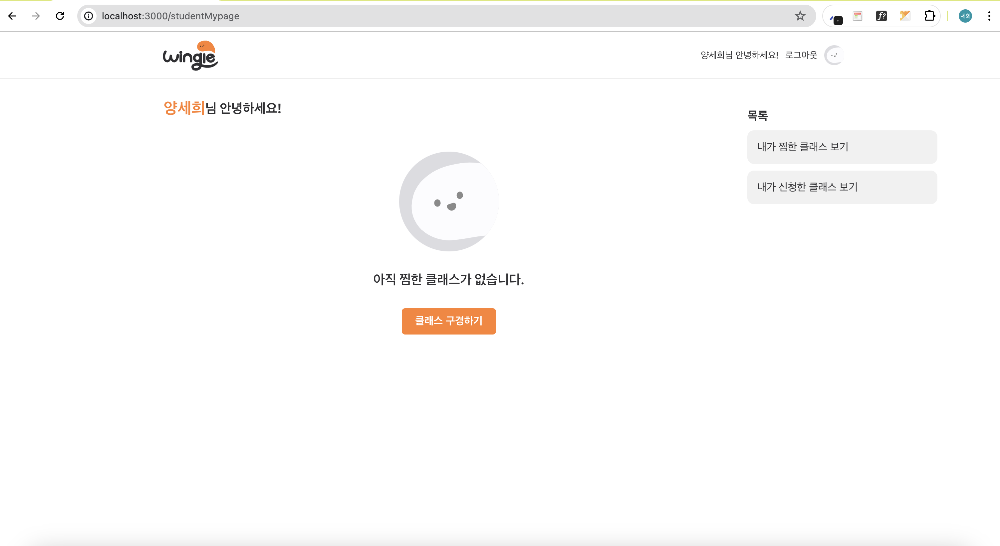

## About Wingle

Wingle은 원데이 클래스 사업자와 고객을 이어주는 O2O(Online to Offline) 비즈니스 플랫폼입니다. 대다수의 원데이 클래스 사업장은 소규모 개인 사업자에 의해 운영되고 있어 홍보나 마케팅에 도전하기 다소 어려운 환경입니다. 저희 Wingle은 최근 원데이 클래스 수요 부상에 발맞춰 보다 쉽고 간편한 원데이 클래스 마케팅 솔루션을 제공합니다. 

### 팀원

양세희 (SMWU CS 20)

박상우 (KAIST CS 22)

### 개발 환경

> **FE**
> 
> - Language : TypeScript
> - Framework: Next.js

> **BE**
> 
> - Language: Typescript
> - Framework: Nest.js
> - Database: SQLite

## 서비스 기획 과정

- 권한: 수강생(student), 전문가(expert)
- 처음 가입할 때 둘 중 하나를 선택하도록 한다.
- 수강생: 수업 듣기 모드, 전문가: 원데이 클래스 업로드, 수정, 삭제
- 전문가가 폼에 맞춰서 클래스의 정보를 업로드
    
    → (입력 폼 안에는 수업 이름, 인원, 가격, 날짜, 전화번호, 전문가 이름, 사진 등이 필수)
    

### [ 주요 기능 ]

로그인 / 회원가입

- Google SSO → email 수집 (고정값)
- JWT

추천

-상단에 캐러셀로 클래스 추천

-최근 생긴 클래스, 찜하기 많은 클래스, 윙글이 추천하는 클래스(랜덤)

수업 등록하기 (Create: 전문가)

수업 리스팅 (Read: 수강생, 전문가)

-카드 형식으로 수업 리스팅

-인기 서비스, 추천 서비스, 카테고리별로 클래스 리스팅

-카드를 누르면 해당 클래스의 상세 페이지로 이동 

→ 클래스 신청하기, 클래스 상세 정보 보기

클래스 수정하기 (Update: 전문가)

클래스 삭제하기 (Delete: 전문가)

마이페이지

-전문가: 자신의 전용 페이지 (내가 연 수업 모두 보기: 최근 순, 오래된 순, 찜하기 많은 순)

-수강생: 내가 찜한 클래스, 내가 신청한 클래스

반응형 포인트: 1024px, 768px, 480px

